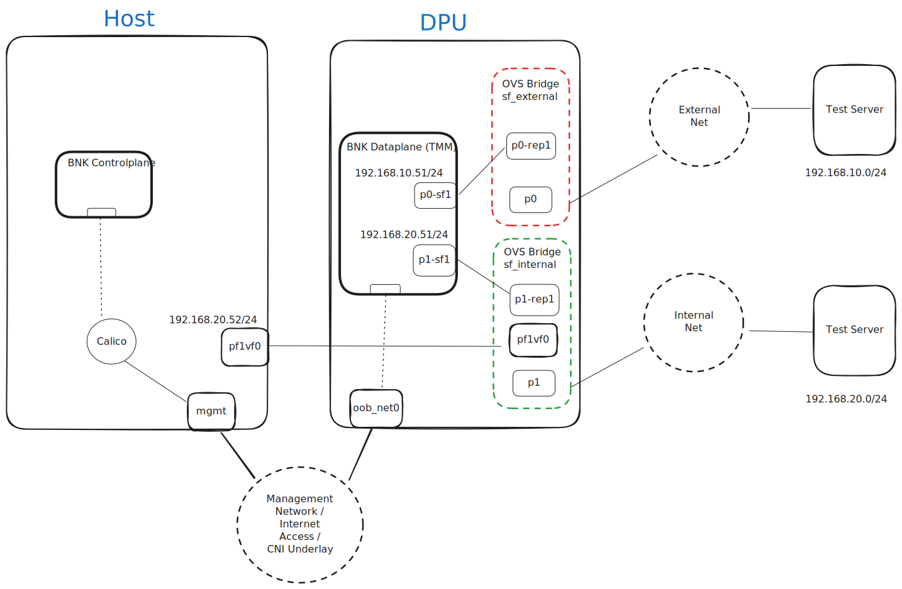

# F5 Titan BIG-IP Next for Kubernetes Install Instructions on Nvidia BlueField-3

- [F5 Titan BIG-IP Next for Kubernetes Install Instructions on Nvidia BlueField-3](#f5-titan-big-ip-next-for-kubernetes-install-instructions-on-nvidia-bluefield-3)
  - [Introduction](#introduction)
  - [BIG-IP Next for Kubernetes Overview](#big-ip-next-for-kubernetes-overview)
    - [Data Plane (TMM)](#data-plane-tmm)
    - [Control Plane](#control-plane)
  - [Lab Setup and Prerequisites](#lab-setup-and-prerequisites)
    - [Deployment Strategy](#deployment-strategy)
    - [Hardware](#hardware)
      - [AUX Cable](#aux-cable)
      - [Network Optics](#network-optics)
      - [GPU (Optional)](#gpu-optional)
      - [DPU](#dpu)
    - [Software Prerequisites](#software-prerequisites)
  - [Installation Steps](#installation-steps)
    - [Prepare the Host](#prepare-the-host)
      - [Install DOCA Software](#install-doca-software)
      - [Configure Rshim service and interface.](#configure-rshim-service-and-interface)
      - [Configure Virtual Function on host](#configure-virtual-function-on-host)
      - [Install Kubernetes](#install-kubernetes)
      - [Prepare for DPU Install](#prepare-for-dpu-install)
    - [Ready to join DPU to K8S](#ready-to-join-dpu-to-k8s)

## Introduction

This guide will help you setup and install F5 BIG-IP Next for
Kubernetes (BIG-IP Next for Kubernetes) on a platform with an Nvidia BlueField-3 DPU.

The NVIDIA DOCA™ Framework enables rapidly creating and managing
applications and services on top of the BlueField networking platform,
leveraging industry-standard APIs. For more information please refer to [DOCA Documentation](https://docs.nvidia.com/doca/sdk/nvidia+doca+overview/index.html).

## BIG-IP Next for Kubernetes Overview

BIG-IP Next for Kubernetes consists of two primary components:

1. **Data Plane**: Handling traffic processing and rules.
2. **Control Plane**: Monitors the Kubernetes cluster state and dynamically updates the Data Plane components.

### Data Plane (TMM)
At the heart of Data Plane is the Traffic Management Microkernel (TMM). Which is responsible for processing network traffic entering and leaving the Kubernetes cluster, as well as integrating with the infrastructure beyond the cluster.
The TMM and it's supporting components are deployed on the Nvidia BlueField-3 (BF3) DPU, fully utilizing its resources and offload engine, and freeing the CPU resources on the host for other tasks.

### Control Plane
The Control Plane runs on the Host CPU worker node or generic workload worker nodes. It also acts as a controller for Kubernetes [Gateway API](https://gateway-api.sigs.k8s.io/)

## Lab Setup and Prerequisites

The following section describes implementation details for a lab setup.

### Deployment Strategy
For the purpose of this document, the diagram below illustrates a high-level deployment strategy for BIG-IP Next for Kubernetes on Nvidia BlueField-3 DPU. It assumes a specific Nvidia BlueField-3 networking configuration, utilizing Scalable Functions, Virtual Functions, and Open vSwitch (OVS) to connect the DPU, Host, and external uplink ports.

This lab guide configures a two node cluster where the host acts as control plan and worker node, and the Nvidia DPU acts as workload node in the same Kubernetes cluster.




There are three main networks in the diagram:\
**Management Network:** The main underlay network for the Kubernetes cluster CNI and has the default gateway to reach internet. Both Host and the Nvidia BF-3 DPU are connected to this network and has addresses configured through DHCP.\
**Internal Net:** Represents an internal network path between the host deployed services and the BNK Dataplane deployed in the DPU. This network will be utilized to route ingress and egress traffic for workload deployed on the host through BNK Dataplane.\
**External Net:** The external network represents an "external-to-the-cluster" infrastructure network segment to reach external services/destinations.

The Test Servers represent clients and servers that are reachable on different segments of the network.\
>_This could also be a single server connected to both Internal and External networks_

### Hardware

This lab guide was tested on the following hardware configurations:
>Note: The hardware list below serves as example for tested platforms. Only one of those or any other Nvidia DPU-3 compatible system is required for this guide.\
>**Note: The Test Servers are not included.**


**DELL Poweredge R750 (AMD64)**

> RAM: 512GB \
> CPU: 96 Cores \
> Storage: 21TB

**Supermicro LB26-R16R12 (ARM64)**

> RAM: 128GB \
> CPU: 96 Cores \
> Storage: 20TB

**Supermicro HGX AS-4125GS-TNRT (AMD64)**

> RAM: 768GB
> CPU: 128 Cores
> Storage: 12TB

**Supermicro MGX ARS-111GL-NHR (ARM64) Supermicro**

> RAM: 512GB \
> CPU: 72Cores \
> Storage: 1.5TB

#### AUX Cable

>**HGX :** Part Numbers - CBL-PWEX-1040 and CBL-PWEX-1148-20
\
>**MGX :** Part Number - CBL-PWEX-1040

The following aux power cable parts also were tested on the Dell servers: \
[Amazon.com: BestParts New 12Pin to 8+8](https://www.amazon.com/BestParts-Compatible-PowerEdge-R750XS-16inches/dp/B0BKKBXQVH) \
[Pin GPU Power Cable Compatible with Dell PowerEdge R750 R750XS R7525 Server 16inches DPHJ8 : Electronics](https://www.amazon.com/BestParts-Compatible-PowerEdge-R750XS-16inches/dp/B0BKKBXQVH)

#### Network Optics

The following network optics were tested on the DPU ports.

**MGX & HGX :** 200Gb SR4 Ethernet Only - [NVIDIA Ethernet MMA1T00-VS Compatible QSFP56 200GBASE-SR4 850nm 100m DOM MPO12/UPC MMF Optical Transceiver Module, Support 4 x 50G-SR - FS.com](https://www.fs.com/products/139695.html)

**Dell R750 :** [F5 Networks F5-UPG-QSFP28-SR4 Compatible QSFP28 100GBASE-SR4 850nm](https://www.fs.com/products/84350.html?attribute=60343&id=3526322) \
[100m DOM MPO-12/UPC MMF Optical Transceiver Module, Support 4 x 25G-SR - FS.com](https://www.fs.com/products/84350.html?attribute=60343&id=3526322)

#### GPU (Optional)

**HGX** = Nvidia H100 (x86)

**MGX** = NVIDIA GH200 (arm64)

#### DPU

**Model :** B3220 Single-Slot FHHL w/ Crypto enabled\
**NVIDIA OPN :** 900-9D3B6-00CV-AA0\
**PSID :** MT_0000000884


### Software Prerequisites

This lab guide will walk you through one setup method of Kubernetes cluster using kubeadm. The guide assumes that you have Ubuntu 22.04 installed on the host machine and the Nvidia BlueField-3 is running in the default DPU mode, and uplink port links set to ETH.

The following list of software is provided should you choose to install Kubernetes cluster differently than described in this guide.


Organizing software requirements for a multi-node Kubernetes cluster involves structuring the information in a way that ensures clarity, maintainability, and completeness for all stakeholders. Here’s a good approach:

| Software             | Version | Node/Selector | Reference |
| :------------------- | :------ | :------------ | :-------- |
| Ubuntu OS            | 22.04   | Host          | DPU OS will be installed as part of bf-bundle.
| DOCA Host            | 2.8+    | Host          | [NVIDIA DOCA Installation Guide for Linux](https://docs.nvidia.com/doca/sdk/nvidia+doca+installation+guide+for+linux/index.html)
| BF Bundle BFB        | 2.8+    | DPU           | [Nvidia DOCA Downloads](https://developer.nvidia.com/doca-downloads?deployment_platform=BlueField&deployment_package=BF-Bundle&Distribution=Ubuntu&version=22.04&installer_type=BFB) |
| Kubelet              | 1.29+   | Host and DPU  | [Kubernetes Kubeadm guide](https://kubernetes.io/docs/setup/production-environment/tools/kubeadm/install-kubeadm/)
| Kubeadm              | 1.29+   | Host and DPU  |                                               
| Kubectl              | 1.29+   | Host and DPU  |                                               
| Containerd           | 1.7.22+ | Host and DPU  | [Containerd Getting Started](https://github.com/containerd/containerd/blob/main/docs/getting-started.md)
| cert-manager         | 1.16.1+ | Host and DPU  | [Cert-manager installation](https://cert-manager.io/docs/installation/)
| SR-IOV Device Plugin | 3.7.0+  | DPU           | [SR-IOV Device Plugin](https://github.com/k8snetworkplumbingwg/sriov-network-device-plugin?tab=readme-ov-file#quick-start)
| Multus               | 4.1.0+  | Host and DPU  | [Multus quick install](https://github.com/k8snetworkplumbingwg/multus-cni#quickstart-installation-guide)
| Calico               | 3.28.1+ | Host and DPU  | [Calico](https://github.com/projectcalico/calico)


## Installation Steps

### Prepare the Host

#### Install DOCA Software

First verify that the Nvidia Bluefield-3 card is installed on the host. For example use `lspci`

```shell
host# lspci | grep BlueField-3
e2:00.0 Ethernet controller: Mellanox Technologies MT43244 BlueField-3 integrated ConnectX-7 network controller (rev 01)
e2:00.1 Ethernet controller: Mellanox Technologies MT43244 BlueField-3 integrated ConnectX-7 network controller (rev 01)
e2:00.2 DMA controller: Mellanox Technologies MT43244 BlueField-3 SoC Management Interface (rev 01)
```

Clean up any previous DOCA packages

```shell
host# for f in $( dpkg --list | grep doca | awk '{print $2}' ); do echo $f ; apt remove --purge $f -y ; done
host# /usr/sbin/ofed_uninstall.sh --force
host# sudo apt-get autoremove
```

Install DOCA-all on host.\
>Note: Make sure to select the correct architecture for the host. In this example it is x86_64.

These instructions are from [DOCA software download site](https://developer.nvidia.com/doca-downloads?deployment_platform=Host-Server&deployment_package=DOCA-Host&target_os=Linux)

```shell
host# export DOCA_URL="https://linux.mellanox.com/public/repo/doca/2.9.1/ubuntu22.04/x86_64/"
host# curl https://linux.mellanox.com/public/repo/doca/GPG-KEY-Mellanox.pub | gpg --dearmor > /etc/apt/trusted.gpg.d/GPG-KEY-Mellanox.pub
host# echo "deb [signed-by=/etc/apt/trusted.gpg.d/GPG-KEY-Mellanox.pub] $DOCA_URL ./" > /etc/apt/sources.list.d/doca.list
host# sudo apt-get update
host# sudo apt-get -y install doca-all
```

#### Configure Rshim service and interface.

RShim establlishes communication channel between the host and DPU. After installing DOCA all or DOCA networking, make sure rshim service is enabled and started.

```shell
host# sudo systemctl enable rshim --now
```

And verify the rshim status

```shell
host# # sudo systemctl status rshim
● rshim.service - rshim driver for BlueField SoC
     Loaded: loaded (/lib/systemd/system/rshim.service; enabled; vendor preset: enabled)
     Active: active (running) since Sun 2024-12-15 18:46:43 UTC; 1 week 2 days ago
       Docs: man:rshim(8)
   Main PID: 3675 (rshim)
      Tasks: 12 (limit: 629145)
     Memory: 2.5M
        CPU: 4h 52min 6.859s
     CGroup: /system.slice/rshim.service
             └─3675 /usr/sbin/rshim

Dec 15 18:46:43 node6 rshim[3675]: pcie-0000:e2:00.2 enable
Dec 15 18:46:44 node6 rshim[3675]: rshim0 attached
```

The Rshim driver exposes a virtual interface named `tmfifo_net0` and the default network configuration for the DPU tmfifo interface is `192.168.100.2/30`\
> Note: If the host has more than 1 DPU attached you will see one `tmfifo_netX` interface per DPU.

Configure an IP address on the host `tmfifo_net0` interface as a way to connect to DPU if needed.
```shell
host# ip addr add 192.168.100.1/30 dev tmfifo_net0
```

For more information on DOCA installation see [DOCA Installation Guide for Linux](https://docs.nvidia.com/doca/sdk/nvidia+doca+installation+guide+for+linux/index.html).

#### Configure Virtual Function on host

As the lab diagram shows, we will configure one Virtual Function on pf1 to connect to internal network.

Assuming the PCI coordinates are as shown before:

```shell
host# lspci | grep BlueField-3
e2:00.0 Ethernet controller: Mellanox Technologies MT43244 BlueField-3 integrated ConnectX-7 network controller (rev 01)
e2:00.1 Ethernet controller: Mellanox Technologies MT43244 BlueField-3 integrated ConnectX-7 network controller (rev 01)
e2:00.2 DMA controller: Mellanox Technologies MT43244 BlueField-3 SoC Management Interface (rev 01)
```
pf1 is at the address `e2:00.1`

Add virtual function:
```shell
host# echo 1 | sudo tee /sys/bus/pci/devices/0000\:e2\:00.1/sriov_numvfs
```

#### Install Kubernetes

Use the following script to install Kubernetes components and requirements.

Change the `MGMT_NET` variable to use your management network CIDR.

```bash
#!/bin/sh

# Script to prepare and install Kubernetes on the host machine.

# Run this as root, use 
if [ "$EUID" -ne 0 ]; then
  echo "Error: This script must be run as root. Please rerun with sudo. Exiting."
  exit 1
fi

# Variables
K8S_VERSION="1.29"
CONTAINERD_VERSION="1.7.23"
RUNC_VERSION="1.2.1"
# Change this value to the management network CIDR that will include both
# the host mgmt IP and DPU oob_net0 mgmt IP.
MGMT_NET="10.144.0.0/16"
TMP_DIR=$(mktemp -d)


ARCH="unknown" # Auto detected
get_system_arch() {
  arch=$(uname -m)
  case "$arch" in
    x86_64)
      ARCH="amd64"
      ;;
    aarch64)
      ARCH="arm64"
      ;;
    *)
      echo "Unsupported system architecture: $arch"
      exit 1
      ;;
  esac
}

install_runc() {
    curl -LO https://github.com/opencontainers/runc/releases/download/v$CONTAINERD_VERSION/runc.$ARCH
    install -m 755 runc.$ARCH /usr/local/sbin/runc
    
}

install_containerd() {
    mkdir -p /etc/containerd
    curl -LO https://github.com/containerd/containerd/releases/download/v$CONTAINERD_VERSION/containerd-$CONTAINERD_VERSION-linux-$ARCH.tar.gz

    tar Czxvf /usr/local/ containerd-$CONTAINERD_VERSION-linux-$ARCH.tar.gz

    /usr/local/bin/ctr oci spec > /etc/containerd/cri-base.json
    cat << EOL > /etc/containerd/config.toml
version = 2
root = "/var/lib/containerd"
state = "/run/containerd"
oom_score = 0
[grpc]
  max_recv_message_size = 16777216
  max_send_message_size = 16777216
[debug]
  address = ""
  level = "info"
  format = ""
  uid = 0
  gid = 0
[plugins]
  [plugins."io.containerd.grpc.v1.cri"]
    sandbox_image = "registry.k8s.io/pause:3.10"
    max_container_log_line_size = 16384
    enable_unprivileged_ports = false
    enable_unprivileged_icmp = false
    enable_selinux = false
    disable_apparmor = false
    tolerate_missing_hugetlb_controller = true
    disable_hugetlb_controller = true
    image_pull_progress_timeout = "5m"
    [plugins."io.containerd.grpc.v1.cri".containerd]
      default_runtime_name = "runc"
      snapshotter = "overlayfs"
      discard_unpacked_layers = true
      [plugins."io.containerd.grpc.v1.cri".containerd.runtimes]
        [plugins."io.containerd.grpc.v1.cri".containerd.runtimes.runc]
          runtime_type = "io.containerd.runc.v2"
          runtime_engine = ""
          runtime_root = ""
          base_runtime_spec = "/etc/containerd/cri-base.json"
          [plugins."io.containerd.grpc.v1.cri".containerd.runtimes.runc.options]
            systemdCgroup = true
            binaryName = "/usr/local/bin/runc"
EOL

    curl -L -o /etc/systemd/system/containerd.service https://raw.githubusercontent.com/containerd/containerd/main/containerd.service
    systemctl daemon-reload
    systemctl enable --now containerd
}

install_kubernetes() {
    apt-get update && apt-get install -y apt-transport-https ca-certificates curl gpg
    mkdir -p /etc/apt/keyrings
    curl -fsSL https://pkgs.k8s.io/core:/stable:/v$K8S_VERSION/deb/Release.key | gpg --dearmor -o /etc/apt/keyrings/kubernetes-apt-keyring.gpg
    echo "deb [signed-by=/etc/apt/keyrings/kubernetes-apt-keyring.gpg] https://pkgs.k8s.io/core:/stable:/v$K8S_VERSION/deb/ /" | tee /etc/apt/sources.list.d/kubernetes.list
    cat << EOL > /etc/sysctl.d/kubernetes.conf
net.bridge.bridge-nf-call-ip6tables=1
net.bridge.bridge-nf-call-iptables=1
net.ipv4.ip_forward=1
fs.inotify.max_user_watches=2099999999
fs.inotify.max_user_instances=2099999999
fs.inotify.max_queued_events=2099999999
EOL
    sysctl --system
    echo "br_netfilter" > /etc/modules-load.d/br_netfilter.conf
    modprobe br_netfilter
    swapoff -a
    sed -i.backup '/swap/d' /etc/fstab
    apt-get update
    apt-get install -y kubelet kubeadm kubectl
    apt-mark hold kubelet kubeadm kubectl
    systemctl enable --now kubelet
    kubeadm init --pod-network-cidr=10.244.0.0/16
    cp -i /etc/kubernetes/admin.conf $HOME/.kube/config
    sleep 30
    kubectl get node
    kubectl create -f https://raw.githubusercontent.com/projectcalico/calico/v3.29.1/manifests/tigera-operator.yaml
    kubectl create -f https://raw.githubusercontent.com/projectcalico/calico/v3.29.1/manifests/custom-resources.yaml
    kubectl taint nodes --all node-role.kubernetes.io/control-plane-
    kubectl set env daemonset/calico-node -n kube-system IP_AUTODETECTION_METHOD=cidr="$MGMT_NET"
    sleep 30
    kubectl get pod --all-namespaces
}


pushd $TMP_DIR

# 1. Get current system architecture
get_system_arch

# 2. Install runc
install_runc

# 3. Install containerd
install_containerd

# 4. Install and init Kubernetes
install_kubernetes

popd

# 5. Cleanup temp dir
rm -rf "$TMP_DIR"
```

#### Prepare for DPU Install

Download bf-bundle from [Nvidia DOCA download](https://developer.nvidia.com/doca-downloads?deployment_platform=BlueField&deployment_package=BF-Bundle&Distribution=Ubuntu&version=22.04&installer_type=BFB)

Create `bf.conf` to customize DPU installation as follows:

```conf
# UPDATE_DPU_OS - Update/Install BlueField Operating System (Default: yes)
UPDATE_DPU_OS="yes"
 
# ubuntu_PASSWORD - Hashed password to be set for "ubuntu" user during BFB installation process.
# Relevant for Ubuntu BFB only. (Default: is not set)
# ubuntu_PASSWORD='$1$PtH/5OX9$u0AeOq0qQPg/gfQx7bTDB1'

###############################################################################
# Other misc configuration
###############################################################################

# MAC address of the rshim network interface (tmfifo_net0).
# NET_RSHIM_MAC=00:1a:ca:ff:ff:06

bfb_modify_os()
{
    # Set hostname
    local hname="testlab-dpu"
    echo ${hname} > /mnt/etc/hostname
    echo "127.0.0.1 ${hname}" >> /mnt/etc/hosts

    # Modules for kubernetes and DPDK
    cat << EOFMODULES >> /mnt/etc/modules-load.d/custom.conf
overlay
br_netfilter
vfio_pci
EOFMODULES

    # sysctl settings for kubernets
    cat << EOFSYSCTL >> /mnt/etc/sysctl.d/kubernetes.conf
net.bridge.bridge-nf-call-ip6tables = 1
net.bridge.bridge-nf-call-iptables = 1
net.ipv4.ip_forward = 1
EOFSYSCTL

    # Provision hugepages as part of grub boot
    # Default to 2M hugepage size and provision 24.5 GB of hugepages
    # TMM requires 1.5GB of hugepages per thread (CPU core) totaling
    # 24GB to run on all 16 threads of the DPU.
    local hpage_grub="default_hugepagesz=2MB hugepagesz=2M hugepages=12544"
    sed -i -E "s|^(GRUB_CMDLINE_LINUX_DEFAULT=\")(.*)\"|\1${hpage_grub}\"|" /mnt/etc/default/grub
    ilog "$(chroot /mnt env PATH=$PATH /usr/sbin/grub-mkconfig -o /boot/grub/grub.cfg)"

    # Provision SF to be used by the TMM on each PF
    for pciid in $(lspci -nD 2> /dev/null | grep 15b3:a2d[26c] | awk '{print $1}')
        do
            cat << EOFSF >> /mnt/etc/mellanox/mlnx-sf.conf
/sbin/mlnx-sf --action create --device $pciid --sfnum 1 --hwaddr $(uuidgen | sed -e 's/-//;s/^\(..\)\(..\)\(..\)\(..\)\(..\).*$/02:\1:\2:\3:\4:\5/')
EOFSF
        done
    # OVS changes
    # 1. Change bridge names to follow internal document as sf_external for pf0
    #    and sf_internal for pf1.
    sed -i -E "s|^(OVS_BRIDGE1=\")(.*)\"|\1sf_external\"|" /mnt/etc/mellanox/mlnx-ovs.conf
    sed -i -E "s|^(OVS_BRIDGE2=\")(.*)\"|\1sf_internal\"|" /mnt/etc/mellanox/mlnx-ovs.conf
    # 2. Add the new created SFs, "sfnum 1" to their corresponding bridges.
    #    Also include the virtual functions that are going to be created on host.
    #    These vfs may not exist yet.
    sed -i -E "s|^(OVS_BRIDGE1_PORTS=\")(.*)\"|\1\2 en3f0pf0sf1\"|" /mnt/etc/mellanox/mlnx-ovs.conf
    sed -i -E "s|^(OVS_BRIDGE2_PORTS=\")(.*)\"|\1\2 en3f1pf1sf1 pf1vf0\"|" /mnt/etc/mellanox/mlnx-ovs.conf

    # Cloud-init for upgrading containerd and runc
    cat << EOFCLOUDINIT >> /mnt/var/lib/cloud/seed/nocloud-net/user-data
write_files:
  - path: /etc/containerd/config.toml
    content: |
      version = 2
      root = "/var/lib/containerd"
      state = "/run/containerd"
      oom_score = 0
      [grpc]
        max_recv_message_size = 16777216
        max_send_message_size = 16777216
      [debug]
        address = ""
        level = "info"
        format = ""
        uid = 0
        gid = 0
      [plugins]
        [plugins."io.containerd.grpc.v1.cri"]
          sandbox_image = "registry.k8s.io/pause:3.10"
          max_container_log_line_size = 16384
          enable_unprivileged_ports = false
          enable_unprivileged_icmp = false
          enable_selinux = false
          disable_apparmor = false
          tolerate_missing_hugetlb_controller = true
          disable_hugetlb_controller = true
          image_pull_progress_timeout = "5m"
          [plugins."io.containerd.grpc.v1.cri".containerd]
            default_runtime_name = "runc"
            snapshotter = "overlayfs"
            discard_unpacked_layers = true
            [plugins."io.containerd.grpc.v1.cri".containerd.runtimes]
              [plugins."io.containerd.grpc.v1.cri".containerd.runtimes.runc]
                runtime_type = "io.containerd.runc.v2"
                runtime_engine = ""
                runtime_root = ""
                base_runtime_spec = "/etc/containerd/cri-base.json"
                [plugins."io.containerd.grpc.v1.cri".containerd.runtimes.runc.options]
                  systemdCgroup = true
                  binaryName = "/usr/local/bin/runc"
  - path: /etc/apt/sources.list.d/kubernetes.list
    content: |
      deb [signed-by=/etc/apt/keyrings/kubernetes-apt-keyring.gpg] https://pkgs.k8s.io/core:/stable:/v1.29/deb/ /
  - path: /var/tmp/setup-script.sh
    permissions: '0755'
    content: |
      #!/bin/bash
      TMPDIR=$(mktemp -d)
      systemctl stop containerd kubelet kubepods.slice
      rm -rf /var/lib/containerd/*
      rm -rf /run/containerd/*
      rm -f /usr/lib/systemd/system/kubelet.service.d/90-kubelet-bluefield.conf
      curl --output-dir ${TMPDIR} -LO https://github.com/opencontainers/runc/releases/download/v1.2.1/runc.arm64
      install -m 755 ${TMPDIR}/runc.arm64 /usr/local/sbin/runc
      curl --output-dir ${TMPDIR} -LO https://github.com/containerd/containerd/releases/download/v1.7.23/containerd-1.7.23-linux-arm64.tar.gz
      tar Czxvf /usr/local/ ${TMPDIR}/containerd-1.7.23-linux-arm64.tar.gz
      /usr/local/bin/ctr oci spec > /etc/containerd/cri-base.json
      curl -L -o /etc/systemd/system/containerd.service https://raw.githubusercontent.com/containerd/containerd/main/containerd.service
      systemctl daemon-reload
      systemctl enable --now containerd
      mkdir -p /etc/apt/keyrings
      curl -fsSL https://pkgs.k8s.io/core:/stable:/v1.29/deb/Release.key | gpg --dearmor -o /etc/apt/keyrings/kubernetes-apt-keyring.gpg
      apt-get update && apt-get install -y kubelet kubeadm kubectl
      systemctl daemon-reload
      systemctl enable --now containerd
      
      rm -rf ${TMPDIR}

runcmd:
  - [ /var/tmp/setup-script.sh ]
EOFCLOUDINIT
}

# bfb_post_install()
# {
#     log ===================== bfb_post_install =====================
#     mst start
#     mst_device=$(/bin/ls /dev/mst/mt*pciconf0 2> /dev/null)
#     # Setting SF enable per Nvidia documentation
#     # Ref: https://docs.nvidia.com/doca/sdk/nvidia+bluefield+dpu+scalable+function+user+guide/index.html
#     # and DPDK documentation
#     # Ref: https://doc.dpdk.org/guides-21.11/nics/mlx5.html
#     log "Setting SF enable and BAR size for $mst_device"
#     for mst_device in /dev/mst/mt*pciconf*
#     do
#       log "Disable port owner from ARM side for $mst_device"
#       mlxconfig -y -d $mst_device s PF_BAR2_ENABLE=0 PER_PF_NUM_SF=1 PF_TOTAL_SF=252 PF_SF_BAR_SIZE=12
#     done
# }
```

To use the custom config and install the DPU bundle use `bfb-install` command

>Note: The command assumes that you downloaded bf bundle file `bf-bundle-2.9.1-30_24.11_ubuntu-22.04_prod.bfb` and both the bundle and the `bf.conf` file are in current directory.
```shell
host# bfb-install --rshim rshim0 --bfb bf-bundle-2.9.1-30_24.11_ubuntu-22.04_prod.bfb --config ./bf.conf
```

Wait for the DPU to finish installation. You can check status using
```shell
host# cat /dev/rshim0/misc
```

### Ready to join DPU to K8S
TODO:
- Join DPU to cluster
- Install Multus
- Install SR-IOV Device Plugin and configmap
- Validate installation and kubernetes services
- jwt token
- operator and product install