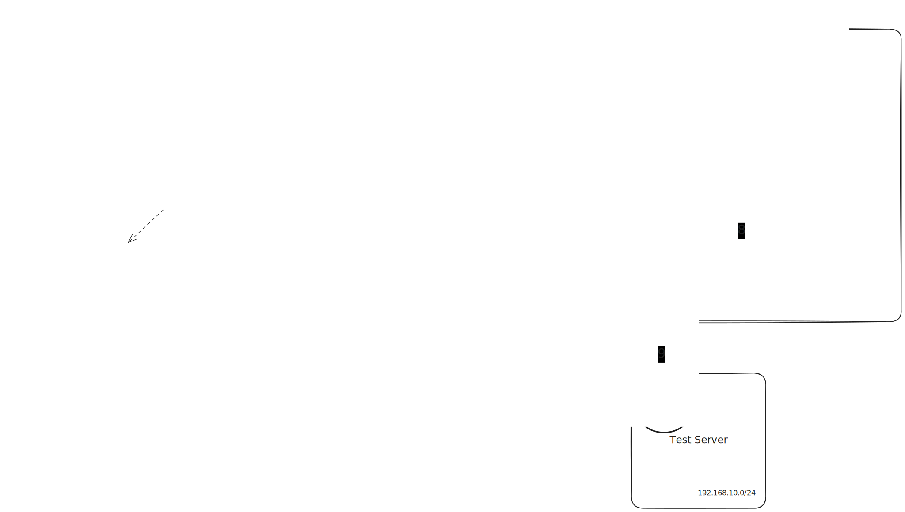

# BNK Egress

This lab guide assumes there will be two namespaces for tenant workload **red** and **blue** and that their egress/ingress is configured through VXLAN overlay. The following diagram shows tenant VXLAN config with focus on the **red** tenant knowing that blue tenant would be the same.



## Configure VXLAN overlay
To configure this we use `F5SPKVxlan` CR which establishes the overlay configurations to the host, a `F5SPKSnatpool` CR to set IP addresses used for SNATing egress traffic towards the network infrastructure, and `F5SPKEgress` CR that assigns the egress rules for namespace to specific VXLAN.

The following `F5SPKVxlan` CRs configures two VXLANs **red** with VNI 100 and **blue** with VNI 200

>NOTE: The virtual function created on host on PF1 is assumed to be `enp83s0f1v0` in this guide. Replace every instance of `enp83s0f1v0` with the actual configured host-side virtual function.

>NOTE: The `remote_nodes` represent the host nodes only. Modify the list to properly reflect cluster node names and configured IP addresses as required. DPU nodes are not required here since workload is only expected on the host.

Apply [bnk-vxlan.yaml](assets/config/bnk-vxlan.yaml) to create VXLAN tunnels for red and blue namespaces.

??? note "Show bnk-vxlan.yaml content"
    ```yaml
    ---8<-- "assets/config/bnk-vxlan.yaml"
    ```


## Configure SNATPool

the `addressList` section is a list of lists of SNAT IP addresses that are assigned to each TMM. Since we have 3 TMMs here, we will create 3 lists one for each TMM.

The SNAT addresess are unique per TMM. And they are picked based on the closest IP address to the nexthop (gateway or direct network) for intended destination.

Apply [bnk-snatpool.yaml](assets/config/bnk-snatpool.yaml) to create SNAT addresses for workload in red and blue namespace.

??? note "Show bnk-snatpool.yaml content"
    ```yaml
    ---8<-- "assets/config/bnk-snatpool.yaml"
    ```

## Configure `F5SPKEgress` to assign tenants egress to their prespective VXLAN

Now we can apply [bnk-egress.yaml](assets/config/bnk-egress.yaml) egress path in TMM with refernce to VXLAN and SNAT pools we just created.

??? note "Show bnk-egress.yaml content"
    ```yaml
    ---8<-- "assets/config/bnk-egress.yaml"
    ```

## Test

TODO
