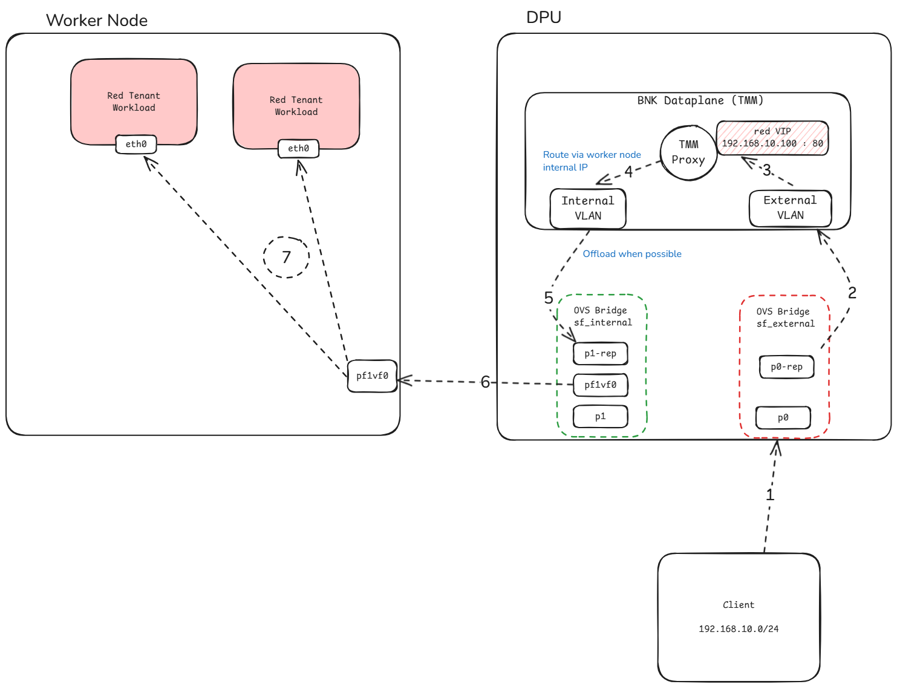

BIG-IP Next for Kubernetes is also a controller for Kubernetes Gateway API. In the following example we will deploy a simple Nginx service in the **red** tenant namespace and advertise it's service to the infrastructure.

The following diagram represents the service ingress path.



Apply the [nginx-deployment.yaml](assets/config/nginx-deployment.yaml) file to deploy Nginx service in the red namespace.

??? note "Show content of nginx-deployment.yaml"
    ```yaml
    ---8<--- "assets/config/nginx-deployment.yaml"
    ```

Then expose the service to network by using Kubernetes Gateway API resources.

Apply the [nginx-gw-api.yaml](assets/config/nginx-gw-api.yaml) file to expose the Nginx service on virtual server IP `192.168.10.100` port `80` as the diagram suggested.

??? note "Show content of nginx-gw-api.yaml"
    ```yaml
    ---8<--- "assets/config/nginx-gw-api.yaml"
    ```

!!! note
    For simplicity an IP address from the same subnet as the test server/client was used but this can be any IP address as long as the server/client is properly routed through one of the TMM's VLAN addresses.

!!! note
    In this configuration, the TMM will use SNAT-AUTOMAP feature which means it will SNAT external client IP addresses when communicating with backend endpoints with TMM's own IP address _not_ an address from snatpool.
