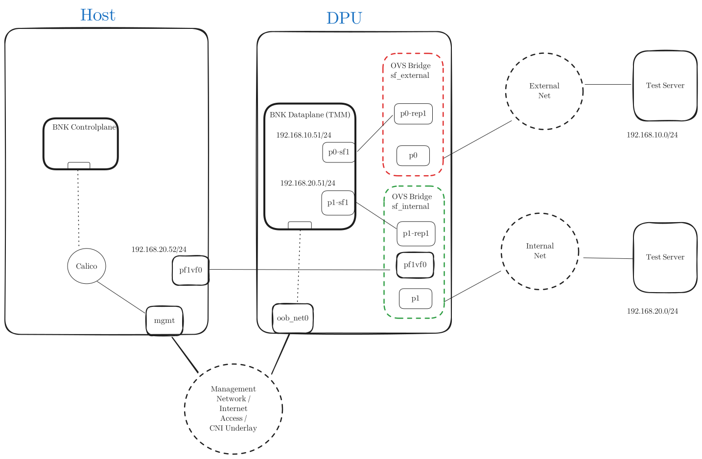

# Lab Configuration

The BIG-IP Next for Kubernetes dataplane component (TMM) executes all networking stack operations entirely in user space and connects to Scalable Function (SF) interfaces using the DPDK driver. The TMM's networking configuration is managed through Custom Resources (CRs), and we will utilize these resources to set up the installation as outlined in the lab diagram.


## Configure the Underlay Network

The underlay network consists of IP addresses directly connected to the physical network segments or infrastructure. These addresses are configured using the `F5SPKVlan` Custom Resource (CR).

The `F5SPKVlan` resources below configure two **untagged VLANs**:
- **internal**: Connected to the internal network segment.
- **external**: Connected to the external network segment.

The IPv4 and IPv6 address lists specify the **underlay IP addresses** reachable through these network segments. Each address from the list is assigned to one instance of TMM. The addresses list must include enough IP addresses enough for the number of TMM instances planned. Foe example if we have 3 DPU nodes, we require **at least three IP addresses in the list**.

The IPv4 and IPv6 address lists define the **underlay IP addresses** reachable through these network segments. Each address in the list is assigned to a single instance of TMM. Ensure the list contains enough IP addresses to match the total number of TMM instances planned.

!!! example
    For example, if there are 3 DPU nodes in the deployment, you will need at least three IP addresses in the list.


To apply this configuration, download, modify if needed, and apply the VLAN configuration file: [bnk-vlans.yaml](assets/config/bnk-vlans.yaml).

??? note "Show content of bnk-vlans.yaml"
    ```yaml
    ---8<--- "assets/config/bnk-vlans.yaml"
    ```

!!! note
    - A VLAN tag value of `0` (`tag: 0`) indicates an **untagged VLAN**. If tagging is required, replace `0` with the desired VLAN tag.
    - Each interface can have **only one untagged VLAN**, while **multiple tagged VLANs** are allowed per interface.
    - VLAN tags must be **unique across all interfaces**. The same VLAN tag cannot be assigned to more than one interface.

When network interfaces, such as **Scalable Functions (SFs)**, are connected to TMM (via the **Network Attachment Definition**), they are assigned **index numbers** based on the order in which they are configured. For example, interfaces are indexed as `1.1`, `1.2`, and so forth. In the `F5SPKVlan` configuration shown above, note the `interfaces` section referencing `1.1` and `1.2`.

!!! note "**Mapping Interfaces in This Lab Guide**"
    This description provides a simplified overview of interface naming for clarity specific to this lab guide.

    - **Network Attachments**:
        - Configured with the names `sf-internal` and `sf-external`.
    - **Interface Mapping in `SPKInfrastructure` CR**:
        - The `SPKInfrastructure` Custom Resource connects these interfaces as follows:
          ```yaml
          networkAttachment:
          - name: default/sf-external
          - name: default/sf-internal
          ```
          The order of the `networkAttachment` section determines the interface assignment:
          - **`sf-external`**: Assigned `1.1`
          - **`sf-internal`**: Assigned `1.2`

To verify the network configuration, check the status of the `F5SPKVlan` Custom Resources:

```console
host# kubectl get f5-spk-vlan
NAME       READY   MESSAGE                                AGE
external   True    CR config sent to all grpc endpoints   30h
internal   True    CR config sent to all grpc endpoints   30h
```

## Configure Calico CNI to allow VXLAN from BNK

In this lab we will build VXLAN networks between the host node and the TMM to segregate tenants based on namespaces. Calico CNI as installed and configured in this lab will create rules to deny VXLAN traffic from different external sources than node list, and thus we need to explicitly allow the TMM VXLAN traffic to pass through host node to workload.

In order to achieve that we need to patch calico's felixconfiguration to allow TMM's internal VLAN IP addresses.

```console
host# kubectl patch felixconfiguration default --type='merge' -p='{"spec": {"externalNodesList": ["192.168.20.201", "192.168.20.202", "192.168.20.203"]}}'
```
