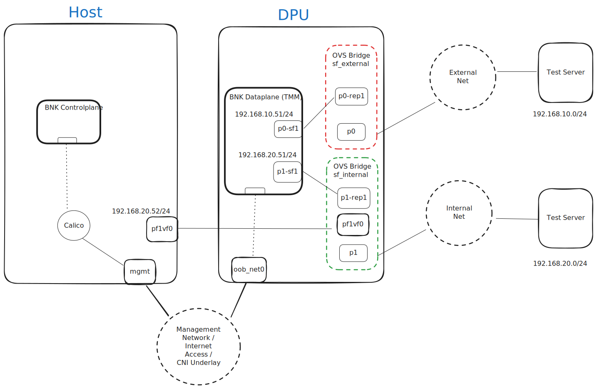

# F5 Titan BIG-IP Next for Kubernetes Install Instructions on Nvidia BlueField-3

## Overview

This guide will help you setup and install F5 BIG-IP Next for
Kubernetes (BIG-IP Next for Kubernetes) on a platform with an Nvidia BlueField-3 DPU.

The NVIDIA DOCA Framework enables rapidly creating and managing
applications and services on top of the BlueField networking platform,
leveraging industry-standard APIs. For more information please refer to [DOCA Documentation](https://docs.nvidia.com/doca/sdk/nvidia+doca+overview/index.html).

## BIG-IP Next for Kubernetes Overview

BIG-IP Next for Kubernetes consists of two primary components:

1. **Data Plane**: Handling traffic processing and rules.
2. **Control Plane**: Monitors the Kubernetes cluster state and dynamically updates the Data Plane components.

### Data Plane (TMM)
At the heart of Data Plane is the Traffic Management Microkernel (TMM). Which is responsible for processing network traffic entering and leaving the Kubernetes cluster, as well as integrating with the infrastructure beyond the cluster.
The TMM and it's supporting components are deployed on the Nvidia BlueField-3 (BF3) DPU, fully utilizing its resources and offload engine, and freeing the CPU resources on the host for other tasks.

### Control Plane
The Control Plane runs on the Host CPU worker node or generic workload worker nodes. It also acts as a controller for Kubernetes [Gateway API](https://gateway-api.sigs.k8s.io/)

## Lab Setup

see [prerequisites](prereq.md)
The following section describes implementation details for a lab setup.

### Deployment Strategy
For the purpose of this document, the diagram below illustrates a high-level deployment strategy for BIG-IP Next for Kubernetes on Nvidia BlueField-3 DPU. It assumes a specific Nvidia BlueField-3 networking configuration, utilizing Scalable Functions, Virtual Functions, and Open vSwitch (OVS) to connect the DPU, Host, and external uplink ports.

This lab guide configures a single Kubernetes cluster that includes Hosts and DPUs as worker nodes. It assumes that one of the hosts will act as a Kuberentes controller (and allows workload deployment) while other hosts and DPUs join the cluster as worker nodes.

/// caption
Figure 1. Lab Network Diagram
///

There are three main networks in the diagram:

**Management Network:** The main underlay network for the Kubernetes cluster CNI and has the default gateway to reach internet. Both Host and the Nvidia BF-3 DPU are connected to this network and has addresses configured through DHCP.

**Internal Network:** Represents an internal network path between the host deployed services and the BNK Dataplane deployed in the DPU. This network will be utilized to route ingress and egress traffic for workload deployed on the host through BNK Dataplane.

**External Network:** The external network represents an "external-to-the-cluster" infrastructure network segment to reach external services/destinations.

The Test Servers represent clients and servers that are reachable on different segments of the network.
>_This could also be a single server connected to both Internal and External networks_

